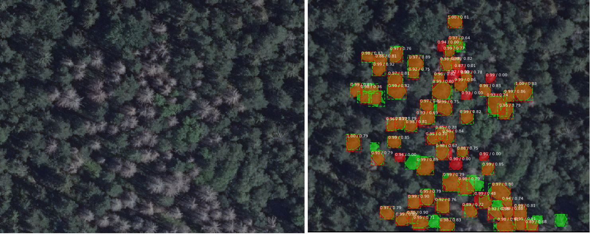

# Mask R-CNN for identifying standing dead pines

#### This is an implementation of mask R-CNN on python 3, keras and tensorflow 2.

This work is based on previous implementation done by [Matterport/Mask_RCNN](https://github.com/matterport/Mask_RCNN)

#### Example result with visualized as semantic segmentation

left: original, right: Green hand annotated, Red predicted


## Installation

```
git clone https://github.com/AndreasGustafsson88/dead_pines_mrcnn_tf2
```

### Install with conda env

```
conda env create -f environment.yml
```

Set up kernel

```
python -m ipykernel install --user --name mask_rcnn_tf2 --display-name "mask_rcnn_tf2"
```

### Run python env

```
pip install -r requirements.txt
pip install .
```

## Usage examples

* set project structure
```
cd data
mkdir models
```
Download [ms_coco_weights](https://github.com/matterport/Mask_RCNN/releases) to /data/models folder


* **Train**
```
cd mrcnn_tf2
train.py -d path/to/dataset 
```

* **Run Inference**

````python
# Specify which model to run inference on
model_name = 'mask_rcnn_snag_0020.h5'
dir_name = '0806_20E'
````

```
cd mrcnn_tf2
predict.py
```

See notebooks for more examples.
* [Training notebook](/Azure_MaskRCNN_tf2.ipynb)
* [Inference notebook](/review_model.ipynb)

### Dataset

Training was done on a very small dataset, 40 images. 
Annotations were made with [VIA annotator tool](https://www.robots.ox.ac.uk/~vgg/software/via/).
Dataset was enhanced using image [augmentation tool](https://github.com/AndreasGustafsson88/image_augmentation)

When loading training data set augmented=True if [augment tool](https://github.com/AndreasGustafsson88/image_augmentation) was used to enhance training data.

````python
dataset_train.load_snags(DATASET_DIR if args.dataset_dir != DATASET_DIR else args.dataset_dir, 'train', augmented=True)
````


